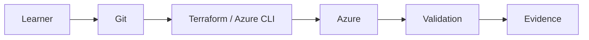

# Lab 00-02-azure-auth — 00 02 Azure Auth

> **Data2AI Academy — Professional Hands-on Lab**

## Business scenario
An engineering team needs a repeatable, reviewable implementation of this capability for an Azure AI platform.

## Mission
Implement **00 02 Azure Auth** as infrastructure and operational practice, then prove it works.

## Architecture

## Prerequisites
- Git
- Azure CLI authenticated to the intended subscription
- Terraform installed for Terraform labs
- PowerShell or Bash
- No secrets committed to the repository

## Tasks
1. Inspect the starter material and identify inputs, dependencies and expected behavior.
2. Implement the smallest correct change.
3. Run formatting and validation checks.
4. Review the plan before applying infrastructure changes.
5. Execute the validation script and save evidence.

## Validation
A successful lab requires observable evidence: resource/state inspection, expected configuration and expected behavior.

## Break/Fix
Introduce one controlled failure and investigate using:
**Symptom → Evidence → Diagnosis → Root Cause → Fix → Validation → Prevention**

## Challenge
Modify one meaningful requirement without changing the learning objective. Explain the trade-off and prove the result.

## Cleanup
Remove only resources created by the lab. Re-check the target resource group/subscription after cleanup.

## Reference solution
The reference solution is intentionally separated from learner instructions. Open it only after completing the challenge.
