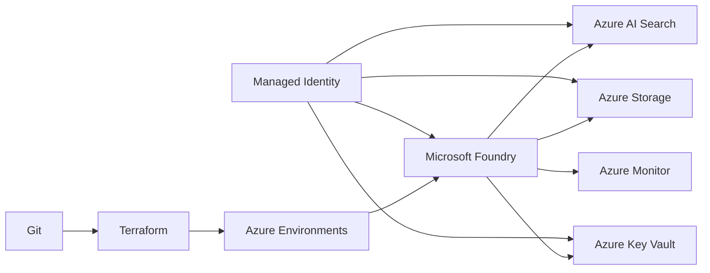
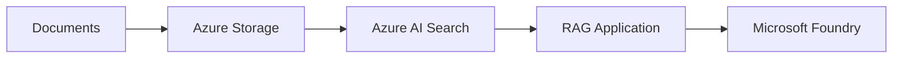
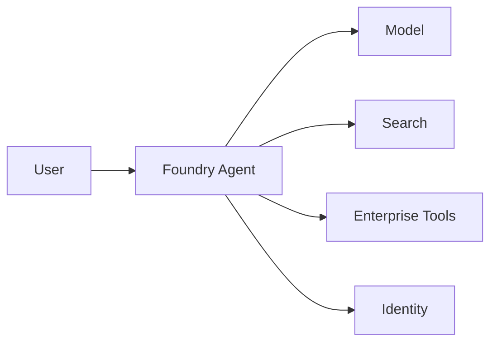
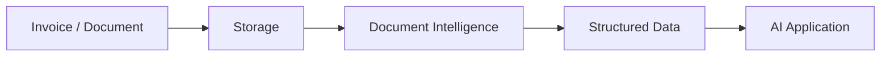

# Reference Azure AI Platform

## Logical architecture

## Scenario architectures

### RAG

### Agent

### Document intelligence

## Security

Identity and authorization should be reasoned about as:

**Identity → Role → Scope → Permission**
