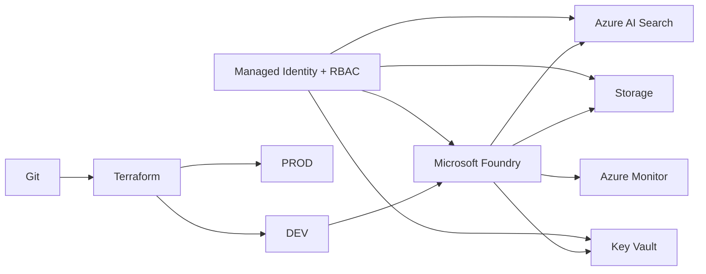
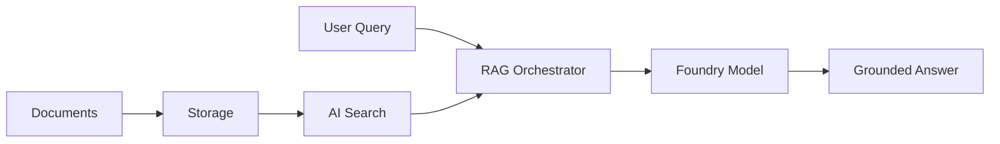
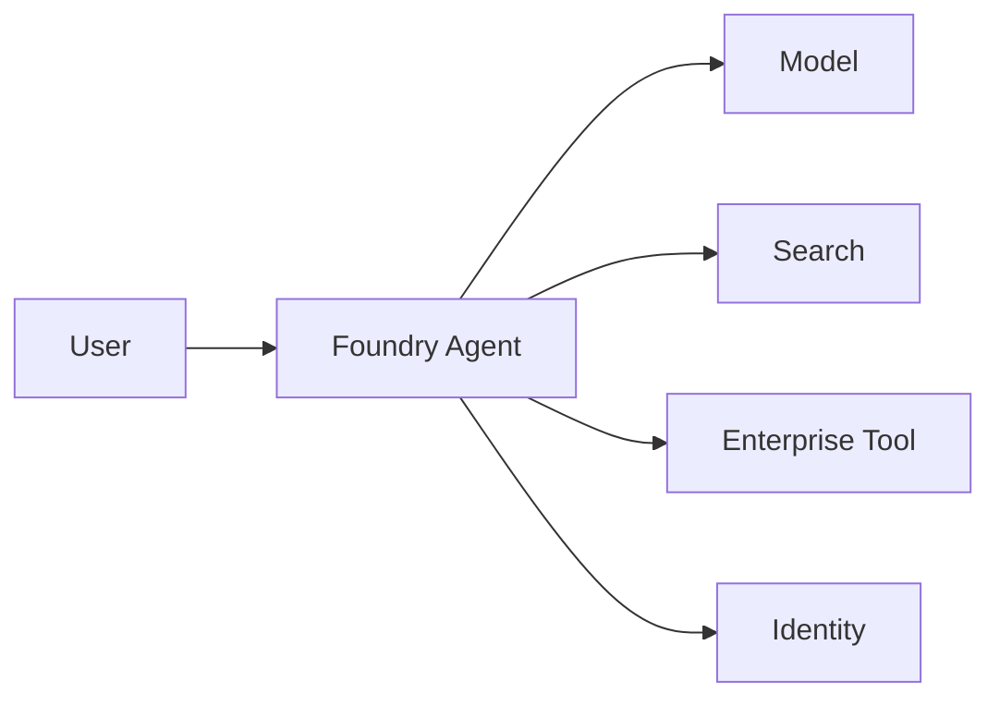

# Reference Platform Architecture

```mermaid
flowchart LR
  G[Git] --> T[Terraform]
  T --> D[DEV]
  T --> P[PROD]
  D --> F[Microsoft Foundry]
  F --> S[Azure AI Search]
  F --> ST[Storage]
  F --> KV[Key Vault]
  F --> MON[Azure Monitor]
  ID[Managed Identity + RBAC] --> F
  ID --> S
  ID --> ST
  ID --> KV
```

## RAG

```mermaid
flowchart LR
 DOC[Documents] --> ST[Storage]
 ST --> IDX[AI Search]
 Q[User Query] --> R[RAG Orchestrator]
 IDX --> R
 R --> F[Foundry Model]
 F --> A[Grounded Answer]
```

## Agent

```mermaid
flowchart LR
 U[User] --> A[Foundry Agent]
 A --> M[Model]
 A --> S[Search]
 A --> TOOL[Enterprise Tool]
 A --> ID[Identity]
```
